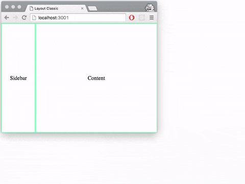
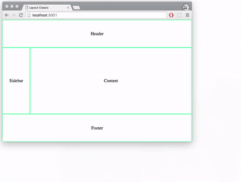

## React Anchor Layout
---
[](https://travis-ci.org/web-plasma5/react-anchor-layout)
[](https://coveralls.io/github/web-plasma5/react-anchor-layout?branch=master)

## Motivation
Handle layout or positioning is always not a happy thing for me, even with flexbox.

The Anchor Positioning System of Qt Quick feels nicer to manage the problem. The goal of this project is to implement something similar to the anchors in Qt Quick.

## Notice

*This is a highly experimental tech. It's a good idea just to stick with flexbox if you are building a product.*

## Get Start
Currently, we can position with (x, y) and define size with (width, height).

```js
import React from 'react';
import FullfillComponent from './FullfillComponent';
import { Rect, calc } from 'react-anchor-layout';

export default function Main() {
  return (
      <Rect
        identifier="root"
        x={0} // zero value can be omitted for x and y
        y={0}
        width={'100%'} // fill the parent
        height={'100%'}
      >
        <Rect
          identifier="sidebar"
          x={0}
          y={0}
          width={100} // fixed width
          height={calc('root').height()} // sidebar.height = root.height
        >
          <FullfillComponent>
            Sidebar
          </FullfillComponent>
        </Rect>
        <Rect
          identifier="content"
          x={calc('sidebar').width()} // content.x = sidebar.width
          y={0}
          width={calc('root').width().minus(calc('sidebar').width())} // content.width = root.with - sidebar.width
          height={calc('root').height()}
        >
          <FullfillComponent>
            Content
          </FullfillComponent>
        </Rect>
      </Rect>
  );
}
```

if you render it to the DOM, it will looks like:



## Basic Concepts

- Rect (a React Component)
- calc (a function to generate a calculator builder)
- identifier (a prop for Rect, it's useful for reference to another Rect when do calculating)
- x, y (props for Rect, coordinates of Rect, relative to the Rect's parent Rect)
- width, height (props for Rect, the size of Rect)

*Rect* Component is used for positioning and sizing another React Component.

*calc* is used for calculating coordinate and size. As the code above shows, calc has the ability of lazy calculating. It does not matter whether the width of the *sidebar* is available or not when calculating the width of the *content*. Just make a calculating builder with *calc* and it will work at last.

*identifier* is needed if you want to make use of the geometry info(x, y, width, height) of a Rect in a calculator. *identifier* is scoped. That means you can use the same name in an application (sidebar is used in Main Component, another sidebar can be used in another Component).

## Demos

### Classic Layout
You can find and try it in examples/classic

> npm install && npm start



## Roadmap
- [x] Positioning with x, y-axis
- [ ] Anchor fill
- [ ] Anchor center
- [ ] Anchor top, right, bottom, left
- [ ] Responsive
